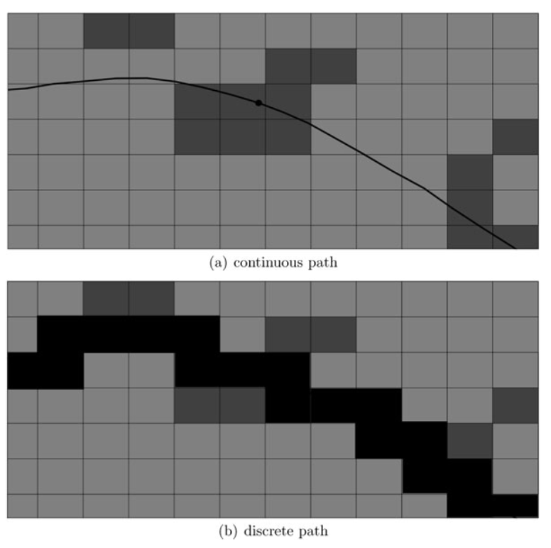

```{r, echo=FALSE}
library(data.table)
library(raster)
library(ggplot2)
library(lubridate)
library(sp)
library(rgdal)
library(rgeos)
library(ctmcmove)
library(splines)
library(fda)
source('/Users/mqwilber/Repos/rsf_swine/code/pigfxns.R')
```


## The questions

There are *many* different questions that we can ask about resource selection using the movement data compiled for this study.  We have decided to an individual-level approach and ask 

What individual movement trajectories of feral swine can tell us about...

1. ...resource use at the *individual-level* and how this resource use varies with time (e.g. by day or by month)? 
2. ...resource use at the *population-level* and how resource use varies between indivuduals in a population?
3. ...resource use *across populations* and how varying factors (temperature, snow cover, ecoregion, etc.) interact resource use to lead to differences in resource use across populations?

The immediate goals of this analysis will be to 

1. Build a dynamic model of pig movement to predict long-term resource selection at the scale of an individual and the population.
2. Understand how the effects of covariates driving movement and resource selection vary temporally and across pig populations in the US.
3. Use the model to generalize what we can say about...

## The modeling framework

To illustrate how we propose to answer the aforementioned questions, we will describe and apply a simplified version of the modeling framework to understand resource selection in feral swine in Camp Bullis, Texas.

### The Camp Bullis data

```{r, echo=FALSE}

## Clean the Camp Bullis Data

# For each pig, remove unrealistic observations
dat = fread("../data/formatted/full_pig_data.csv")
tcdat = dat[study == "txcamp"]
rm(dat) # Free up some space

# At least three pigs have some errant movements
tplot = ggplot(tcdat) + geom_path(aes(x=longitude, y=latitude)) + facet_wrap(~pigID)

# There are a few pigs where we seem to have errant movements: txcamp20141, txcamp20150, txcamp20169.  For these pigs, let's identify potential outliers in movement

badpigs =c("txcamp20141", "txcamp20150", "txcamp20169")

badout = array(NA, dim=3)
fullind = array(NA, dim=3)

for(i in 1:length(badpigs)){
  
  bp = badpigs[i]
  bpdat = tcdat[pigID == bp, list(longitude, latitude)]
  kmeans.result = kmeans(bpdat, 1)
  centers = kmeans.result$centers[kmeans.result$cluster, ]
  distances <- sqrt(rowSums((bpdat - centers)^2))
  
  outliers <- order(distances, decreasing=T)[1:5]

  # print(outliers) 
  badout[i] = outliers[1]
  fullind[i] = which((tcdat$pigID == bp) & (tcdat$longitude == bpdat$longitude[outliers[1]]) & (tcdat$latitude == bpdat$latitude[outliers[1]]))
  
  #plot(bpdat[,list(longitude, latitude)], pch=19, col=kmeans.result$cluster, cex=1)
  #points(kmeans.result$centers[, c("longitude", "latitude")], col=1:3, pch=15, cex=2)
  #points(bpdat[outliers, c("longitude", "latitude")], pch="+", col=4, cex=3)

  
}


# Remove the substantial outliers.

trimdat = tcdat[-fullind, ]
tp = ggplot(trimdat) + geom_path(aes(x=longitude, y=latitude)) + facet_wrap(~pigID)

# Now, given that behavior can change over the course of the season, we likely want to make inference over consistent time intervals. Let's look at a plot of collaring times.

trimdat$datetime = as.POSIXct(trimdat$datetime, tz="GMT")
collarDur = trimdat[, list(mindate=min(datetime), maxdate=max(datetime)), by=pigID]
tp = ggplot(data=collarDur) + geom_linerange(aes(x=pigID, ymin=mindate, ymax=maxdate)) + 
          theme(axis.text.x = element_text(angle = 90, hjust = 1,  size=3)) + 
          scale_y_datetime(breaks = seq(min(collarDur$mindate), max(collarDur$maxdate), by="month"))


# Which pigs are between have at least `clength` consecutive fixes of `ctime` minutes or less?

lrdat = trimdat[, list(lr=runs(datetime, ctime=200, clength=5000)), by=pigID]
longdat = merge(trimdat, lrdat, by="pigID")[lr == TRUE]

collarDur2 = longdat[, list(mindate=min(datetime), maxdate=max(datetime)), by=pigID]
tp = ggplot(data=collarDur2) + geom_linerange(aes(x=pigID, ymin=mindate, ymax=maxdate)) + 
          theme(axis.text.x = element_text(angle = 90, hjust = 1,  size=10)) + 
          scale_y_datetime(breaks = seq(min(collarDur2$mindate), max(collarDur2$maxdate), by="month"))

n = nrow(longdat)
deltas = longdat[order(pigID, datetime), list(deltat=diff(datetime)),  by=pigID]
#deltas[, list(units=units(deltat)), by=pigID]
#max(deltas$deltat)
#min(deltas$deltat)
tplot = ggplot(deltas) + geom_boxplot(aes(x="pig", y=deltat)) + facet_wrap(~pigID)

for(pid in unique(longdat$pigID)){

  tp = longdat[pigID == pid, ]
  #plot(tp$datetime, main=pid, type="l")
  
  if(pid == "txcamp20154"){
    imax = which.max(deltas[pigID == pid, deltat])
    # print(tp[c(imax, imax + 1), datetime])
    exdate = tp[c(imax + 1), datetime]
    
  }
  
}
  

# Exclude everything before "2016-06-20 00:00:09 GMT" for "txcamp20154" as there is a large time gap.  This looks to be the same individual pig though based on the data.

longdat2 = longdat[!(pigID == "txcamp20154" & datetime < exdate), ]

collarDur3 = longdat2[, list(mindate=min(datetime), maxdate=max(datetime)), by=pigID]
tp = ggplot(data=collarDur3) + geom_linerange(aes(x=pigID, ymin=mindate, ymax=maxdate)) + 
          theme(axis.text.x = element_text(angle = 90, hjust = 1,  size=10)) + 
          scale_y_datetime(breaks = seq(min(collarDur3$mindate), max(collarDur3$maxdate), by="month"))

# A total of 26 pigs to consider

for(pid in unique(longdat2$pigID)){
  tp = longdat2[pigID == pid, ]
  # plot(tp$datetime, type="l")
}

# longdat2[, list(maxdelta=max(diff(datetime)), mindelta=min(diff(datetime)), meddelta=median(diff(datetime))), by=pigID]

# The largest time gap we have is around 24 hours. It might be useful to clean that data further, but for now we will use imputation to account for the uncertainty around these trajectories.  Will be important to assess the sensitivity of the analysis to some of these gaps.
```

The Camp Bullis pigs are from slightly north of San Antonio, Texas.  There are a total of 32 pigs with movement trajectories shown below.  The data has been cleaned to remove obviously errant movements, and pruned to eliminate long times between fixes (e.g. > 12 hours).

```{r, echo=FALSE}
ggplot(longdat2[pigID %in% unique(pigID)[1:16]]) + geom_path(aes(x=longitude, y=latitude)) + facet_wrap(~pigID) + 
                theme_bw() + theme(axis.text.x = element_text(angle = 90, hjust = 1))

ggplot(longdat2[pigID %in% unique(pigID)[16:32]]) + geom_path(aes(x=longitude, y=latitude)) + facet_wrap(~pigID) + 
                theme_bw() + theme(axis.text.x = element_text(angle = 90, hjust = 1))
#ggplot(longdat2[pigID %in% unique(pigID)[16:32]]) + geom_path(aes(x=longitude, y=latitude)) + facet_wrap(~pigID)

```

The questions we can ask from this data are 

1. How do covariates (i.e. resources) affect the movement dynamics of these pigs and how does that affect their long-term resource selection? 
2. How does this resource selection vary temporally?
3. How does this resource selection vary among individuals in the population?

The approach described below is based of the methods of @Hanks2015, @Buderman2016, and @Wilson2018 .

## Choosing covariates that affect movement and resource use

### General note on covariates

In the files we sent around there is a table of potential covariates that we could in the broader analysis (TODO: ADD FILE NAME HERE).  **Please suggest other covariates and/or sources for covariates that you think would be useful to include**. 

In the end, we are going to be judicious with our choice of covariates based on the specific questions that we want to address with the large-scale analysis. This will prevent us falling into the trap of throwing a bunch of covariates into a model and seeing what pops out.  However, for now we a trying to compile a comprehensive list, so suggestions are very welcome! 

Ideally, we want to find covariates that are biologically meanginful and consistent across the various studies so that they are comparable across pig populations (e.g. temperature or NDVI).  

### Covariates for Camp Bullis

For this example, we are going to choose a realistic subset of covariates that a) we think are important for resource selection and b) illustrate the proposed modeling framework.

**Covariates used in Camp Bullis example**

1. *Forest cover*: A binary coviarate, 0 = non-forested habitat and 1 = forested habitat
  - Time-varying by year
  - 30m scale
  - Biological relevance: Potentially important for cover and foraging [@McClure2015]
2. *NDVI*: Standard NDVI index from VegScape
  - Time-varying by month
  - 30 m scale
  - Biological relevance: A proxy for forage availability or cover.  Potentially correlated with forest cover.
3. *NDVI gradient*: The gradient of NDVI at any given location.
  - Derived from NDVI
  - 30 m scale.
3. *Temperature*: Temperature of a given area 
  - Time-varying by year
  - ~50 km scale
  - Biologial relevance: Important for pig thermoregulation [e.g. @McClure2015; @Kay2017]
4. *Distance to cropland*: A gradient measuring the weighted-by-distance "pull" of cropland in an area at the current location
  - Derived from CropScape
5. *Distance to grains, hay, and seeds*: A gradient measuring the weighted-by-distance "pull" of grains, hay, and seeds in an area at the current location.
  - Derived from CropScape
  - 30 m scale
6. *Distance to open water*: Same as above, but a water-based gradient
  - Derived from CropScape.  Though, there are better hydrological layers that we can use
  - 30 m scale

## Single-pig analysis

Focusing on a single pig from the Texas Camp Study (e.g. pig \# 20125)

```{r, echo=FALSE}
pig1 = longdat2[pigID == "txcamp20125"]
ggplot(data=pig1) + geom_path(aes(x=longitude, y=latitude)) + theme_bw()
```
some example visualizations of the covariates in the region over which this pig moved are as follows.

```{r, echo=FALSE, warning=FALSE}
source("pigfxns.R")
source("covariate_scripts/covariate_fxns.R")
pig1 = longdat2[pigID == "txcamp20125"]
buffer = 0.0005
extobj = extent(min(pig1$longitude) - buffer, max(pig1$longitude) + buffer, min(pig1$latitude) - buffer, max(pig1$latitude) + buffer)

loc_stack = process_covariates(c("temperature", "croplayer", "ndvi"), "txcamp", extobj, min(pig1$datetime), max(pig1$datetime), ext="loc")
grad_stack = process_covariates(c("ndvi", "elevation"), "txcamp", extobj, min(pig1$datetime), max(pig1$datetime), ext="grad")

# Compute the distance2item gradients
gradxy_stack = process_covariates(c("croplayer"), "txcamp", extobj, min(pig1$datetime), max(pig1$datetime), ext="grad", distgrad=TRUE)
gradx_stack = stack(lapply(gradxy_stack, function(x) x$xgrad))
grady_stack = stack(lapply(gradxy_stack, function(x) x$ygrad))

# Ensure projections are the same
locnames = names(loc_stack)
loc_stackproj = stack(lapply(loc_stack, function(x) projectRaster(x, loc_stack[['crops_2016_loc']], method="bilinear")))
grad_stackproj = stack(lapply(grad_stack, function(x) projectRaster(x, loc_stack[['crops_2016_loc']], method="bilinear")))

plot(stack(unstack(loc_stackproj)[9]), main="Forest Cover")
ndvi = stack(unstack(loc_stackproj)[11:16])
plot(ndvi)#, col=rev( rainbow(50, start=0,end=1 ) ), breaks=seq(min(minValue(ndvi)),max(maxValue(ndvi)),len=50))


```


```{r, warning=FALSE, echo=FALSE}
loc_stackproj = stack(lapply(loc_stack, function(x) projectRaster(x, loc_stack[['crops_2016_loc']], method="ngb")))
```
Keep in mind the colorbars are on different scales for the NDVI variable, but it is sufficient to say that this variable is 
dynamic.

---

Given we have an individual movement trajectory and environmental covariates, we want to figure out how these covariates affect movement and how this in turn affects resource selection. Combining the approach of @Hanks2015 and @Buderman2016, we can break this into three steps

1. Fitting a continuous-time movement model to the pig trajectory so that we can account for the fact that not all fix times are equal.
  - Following @Buderman2016, a basis function approach provides a fast and easy way to do this.

2. Use this *continuous-time* movement trajectory to convert to a *discrete-space* movement path.  

3. Use this "continuous-time and discrete space" model formulation to explore how covariates/resources affect movement and long-term resource selection.

### Step 1: Fit a continuous-time movement model to pig data

Using a basis function approach [i.e. fitting splines, @Buderman2016], it is straight-forward to fit a continuous-time movement model that accounts for measurement error.  Generally, this simplifies to fitting the following multivariate regression to the movement data

$$\mathbf{y} \sim \text{MVN}(\mathbf{X} \beta, \mathbf{\Sigma})$$
where $\mathbf{y}$ is a n x 2 vector of longitude and latitude, $\mathbf{X}$ is the $n \times p$ desired basis expansion of time (i.e. the design matrix), $\beta$ is a $p \times 2$ matrix of coeficients, and $\Sigma$ is the covariance matrix. This fast to implement in either or a frequentist or Bayesian framework.


Fitting a continuous-time basis function model, we can then simulate movement trajectories at any time step.  For example, the plot below shows three simulations at 15 minute intervals (the colored lines) of the best-fit movement model to the first 1000 fixes from pig 20125 from Camp Bullis (black lines + dots are the first).

```{r}
dat  = pig1[1:1000, list(x=longitude, y=latitude, datetime=datetime)]
predinterp = continuous_path(dat, "15 mins", "interp")

#plot(dat[, list(x, y)], type="b")
#points(predinterp$paths[[1]], cex=0.1, col="red")

predbfreq = continuous_path(dat, "15 mins", "bspline_freq", impute=3, df=800, sigma.fixed = 0.001)

plot(dat[, list(x, y)], type="b",  ylab="Latitude", xlab="Longitude")
points(predbfreq$paths[[1]], type="l", col="red")
points(predbfreq$paths[[2]], type="l", col="blue")
points(predbfreq$paths[[3]], type="l", col="green")
```
Obviously, we are skipping over a lot of detials here that we'd be happy to chat about (e.g. appropriately accounting for measurement error, overfitting, etc.), but the gist is that fitting a continuous time model will

1. Allow us to account for unequal fix times across individuals within a study and across studies
2. Allow us to sync up the time scale of inference across studies (i.e. ensure we are making inference on movement dynamics and resource selection )

<!-- Three options here: -->

<!-- 1. Use simple interpolation -->
<!--   - **Advantage**: Because this approach assumes perfect data, we will recover the observed locations when we ``simulate'' the the movement path. -->
<!--                    Fast and easy to calculate trajectories. -->
<!--   - **Disadvatanges**:  Does not propoerly account for uncertainty in movement.  Particularly if there is a long time (e.g. 3 hours) between fixes, -->
<!--                    this approach just interpolates a straight-line between points which might be very wrong. -->
<!-- 2. Use a b-spline approach in a frequentist framework -->
<!--   - **Advantages**: Captures uncertainty in movement path and can propagate this uncertainty through to parameter estimates of resource selection.  -->
<!--   - **Disadvantages**: While quite fast for small to medium data, both fitting and uncertainty estimation are pretty slow for large data (e.g. 100,000 predictions). -->
<!-- 2. Use a b-spline approach in a Bayesian framework (`mcmc.fmove`) -->
<!--   - **Advantages**:  Same advantages as above. But also regularlizations is baked into this approach which is quite useful. -->
<!--   - **Disadvatanges**:  Will need to check convergence of MCMC chains for each site, which could be time consuming across populations. Moreover, long MCMC runs may take awhile, but preliminary simulations suggest that these might not be too much slower than the frequentist fit (seems strange...). -->


```{r, echo=FALSE}
source("pigfxns.R")

dat  = pig1[1:1000, list(x=longitude, y=latitude, datetime=datetime)]
predinterp = continuous_path(dat, "15 mins", "interp")

# plot(dat[, list(x, y)], type="b")
# points(predinterp$paths[[1]], cex=0.1, col="red")

predbfreq = continuous_path(dat, "15 mins", "bspline_freq", impute=3, df=500, sigma.fixed = 0.001)

# plot(dat[, list(x, y)], type="b")
# points(predbfreq$paths[[1]], type="l", col="red")
# points(predbfreq$paths[[2]], type="l", col="blue")
# points(predbfreq$paths[[3]], type="l", col="green")

predbbayes = continuous_path(dat, "15 mins", "bspline_bayes", impute=3, sigma.fixed = NA, df=500)

# plot(dat[, list(x, y)], type="b")
# points(predbbayes$paths[[1]], type="l", col="red")
# points(predbbayes$paths[[2]], type="l", col="blue")
# points(predbbayes$paths[[3]], type="l", col="green")
```

### Step 2: Convert to a continuous-time discrete space model

Because the covariates on the landscape are discrete (e.g. forest cover is measured on a 30m by 30m scale), we can discretize the "state" of our continuous-time movement trajectory such that we are modeling a continuous time-discrete state process. The following figure from @Hooten2010 illusrates the the concept of discretizing in space



@Hanks2015 describe how to analyze this continuous-time Markov Chain (CTMC) with respect to questions about how resources affect animal movement. Conceptually, the CTMC approach allows you to do is ask how the **speed** and **direction** of animal movement relate to various covariates (i.e. more specifically how the transition rates of the CTMC relate to various covariates) and what this means for the long-term/stationary distribution of resource utilization [@Wilson2018]. 

### Step 3: Fit the CTMC with covariates

There are two types of covariates to consider in this framework

1. Location-based covariates: Covariates that affect the rate that an animal leaves the cell that they are currently in.
  - e.g. When pigs enter a forested cell, they tend to slow down such that they remain in this cell longer. This is a location effect.
2. Gradient-based covariates: Gradients of covariates that affect the direction of the next step that the animal
  - e.g. When a pig moves to a new cell, they tend to move in the direction of the nearest water source. This is a gradient effect.

Earlier in this document, we described the various covariates we were considering in this Camp Bullis example. These consist of both location- and gradient-based covariates. 

For pig \#20125 in Camp Bullis, we want to know how these covariates affect transition rates. In particular, is $\lambda_{i_t, j_t}$ is the rate of transitioning from cell $i$ to cell $j$ at time $t$, this rate can be defined as [@Hanks2015]

$$\lambda_{i_t, j_t} = \exp(x_{i_t, j_t}' \beta)$$

where $x_{i_t, j_t}'$ is a vector of location-based (forest cover, NDVI$(t)$, temperature$(t)$) or gradient-based (distance to crops, distance to open water, distance to grain-hay-seeds, NDVI gradient) covariates specific to cells $i$ and $j$ and time $t$ and $\beta$ are unknown coefficients.  Notice that this looks similar to the classic formulation of resource selection functions framed as GLMs [e.g. @Boyce1999] and it turns out that we can leverage this similarity to use standard GLM tools to estimate to estimate $\beta$: the effect of a unit change in a covariate on log-transition rate from cell $i$ to $j$ at time $t$.

For pig \#20125 in Camp Bullis and the covariates given above, we convert the 

```{r, echo=FALSE}
source("pigfxns.R")
dat = pig1[1:17000, list(x=longitude, y=latitude, datetime=datetime)]
glm_data = fit_ctmcmodel(dat, pig1$pigID[1], loc_stackproj, grad_stackproj, method="interp", impute=4,
                         buffer=0.001, mc.cores=4, df=100, sigma.fixed=0.001, path2ctmcMethod = "ShortestPath",
                         xygrad=TRUE, xgrad.stack = gradx_stack, ygrad.stack=grady_stack,
                         grad.point.decreasing=FALSE)
glm_data = as.data.table(glm_data)
```

```{r, echo=FALSE}
pglmdat = process_glmdata(list(glm_data),
                            c("temperature", "ndvi.*loc", "ndvi.*grad", "forest.*loc",
                              "crop.*loc", "openwater.*loc", "grain.*loc", "crop.*grad", 
                              "grain.*grad", "openwater.*grad"),
                            c("temperature_loc", "ndvi_loc", "ndvi_grad", "forest_loc", 
                              "crop_loc", "water_loc", "grain_loc", "crop_grad", "grain_grad", "water_grad"),
                            c("my", "my", "my", "y", "y", "y", "y", "y", "y", "y"))

pglmdat = lapply(pglmdat, function(x) x[, c('z', 'pigID', 'temperature_loc', 'ndvi_loc', 'ndvi_grad', 
                                      'forest_loc', 'crop_loc', 'water_loc', 'grain_loc', "crop_grad", 
                                      "grain_grad", "water_grad", 'imputeID', 
                                      'crw', 'x.current', 'y.current', 'x.adj', 'y.adj', 'tau', 't', 'datetime', 
                                      'elevation_grad')])[[1]]
```

```{r, echo=FALSE}
fit = glm(z ~ forest_loc + scale(ndvi_loc) + scale(ndvi_grad) + 
                            scale(grain_grad) + scale(crop_grad) +
                            scale(water_grad) + scale(crw), family='poisson', offset=log(tau), data=pglmdat)

summary(fit)
```

The above results can be interpreted as follows:

1. `forest_loc` (Location-based effect of forest): This pig slows down in forested habitat relative to non-forested habitat.  This could be due to foraging or resting. 
2. `ndvi_loc` (Location-based effect of NDVI): This pig also moves slower through habitat with higher values of NDVI (higher "productivity"/vegetation cover).  This is likely related to the effect of forest, though the correlation between `forest_loc` and `ndvi_loc` is minimal.
3. `ndvi_grad` (Gradient-based effect of NDVI): This pig doesn't tend to move up or done the NDVI gradient.
4. `grain_grad` (Gradient-based effect of grain, hay, and seeds): The pig tends to move *toward* grain, hay, and seeds, though the effect is weak.
5. `crop_grad` (Gradient-based effect of crop): The pig shows a slight tendency to move away from crops. 
5. `water_grad` (Gradient-based effect of water: The pig shows a slight tendency to move away from open water.  Note that the water covariate used here is from Cropscape and there is only a single open water pixel in this pigs extent.  More accurate hydrological layers can/should be used.
6. `crw`: (Correlative random walk component of movement): Conditional on movement, this pig tends to continue moving in the direction that it moved in the previous time step.

### Long-term resource-use

The fitted model above describes a dynamic model of animal movement on a landscape.  We can then use this model to predict the long-term resource utilization distribution for pig \#20125 -- the stationary distribution of the pig on the landscape.


```{r}

source("pigfxns.R")
fit2 = glm(z ~ forest_loc + ndvi_loc + ndvi_grad +
                            grain_grad + crop_grad + water_grad +
                            crw, family='poisson', 
                            offset=log(tau), data=pglmdat)
locstack = stack(unstack(loc_stackproj)[c(9, 11)])

names(locstack) = c("forest_loc", "ndvi_loc")
gradstack = stack(unstack(grad_stackproj)[c(1, 7)])
names(gradstack) = c("ndvi_grad", "elevation_grad")
gradxstack = stack(unstack(gradx_stack)[c(1, 2, 3)])
gradystack = stack(unstack(grady_stack)[c(1, 2, 3)])
names(gradxstack) = c("crop_grad", "grain_grad", "water_grad")
names(gradystack) = c("crop_grad", "grain_grad", "water_grad")

ext = as.vector(extent(locstack))
ext[1] = -98.55 
ext[4] = 29.758
ext = extent(ext)

#vl = values(locstack)
#vg = values(gradstack)
#values(locstack)[is.na(vl[, 2]), ] = mean(vl[, 2], na.rm=T)
#values(gradstack)[is.na(vg[, 1]), ] = mean(vg[, 1], na.rm=T)

R = getR(fit2, stack(crop(locstack, ext)), stack(crop(gradstack, ext)), grad.point.decreasing = FALSE, xygrad=TRUE, stack.xgrad=stack(crop(gradxstack, ext)),
         stack.ygrad=stack(crop(gradystack, ext)))
pi = get.UD(R)
ud = crop(unstack(locstack)[[1]], ext)
values(ud) = log(pi)
plot(ud)
#points(pig1$longitude[1:10000], pig1$latitude[1:10000])
```

You can clearly see the effect of the forest variable on the long-term resource utilization distribution.  Moreover, the location of grain, hay, and seeds (seen as green pixels below)

```{r, echo=FALSE}
plot(loc_stackproj$grainshayseeds_2016_loc)
```

results in a higher probability of long term use in the region surrounding these fields (green pixels).

## Time-varying resource use

The above analysis focuses on *time-variant* resource use (i.e. the effect of covariates are constant through time).  It is likely more realistic that that these effects vary over time. Now showing it here, but it is easy to incorporate time-varying effects of resource use into this framework to ask questions such as: How does a pigs use of forest change over the course of a day?

```{r, echo=FALSE}
library(glmnet)
pglmdat$hour = hour(pglmdat$datetime)

df = 8
# Build time-dependent design matrix
bs_hours = bs(pglmdat$hour, df=df) # B-spline basis for time effect
bs_hours_forest_loc = pglmdat$forest_loc * bs_hours
bs_hours_crw = pglmdat$crw * bs_hours
bs_hours_ndvi_loc = pglmdat$ndvi_loc * bs_hours
bs_hours_ndvi_grad = pglmdat$ndvi_grad * bs_hours
bs_hours_grain_grad = pglmdat$grain_grad * bs_hours
X = cbind(1, bs_hours, bs_hours_forest_loc, bs_hours_crw, bs_hours_ndvi_loc, 
                bs_hours_ndvi_grad, bs_hours_grain_grad)
colnames(X) = c("Intercept", paste0("hour_", 1:df), paste0("hforest_", 1:df), paste0("hcrw_",  1:df),
                 paste0("hnloc_",  1:df), paste0("hngrad_",  1:df), paste0("hggrad_",  1:df))

# fit_time1 and fit_time2 are the same, just showing how to build the basis design matrix
fit_time2 = glm.fit(x=X, y=pglmdat$z, family=poisson(link="log"), offset=log(pglmdat$tau))

fit_timecv = glmnet(X, y=pglmdat$z, family="poisson", offset=log(pglmdat$tau), alpha=1)
# fit_cv = cv.glmnet(model.matrix(fit), y=glm_data$z, family="poisson", offset=log(glm_data$tau), alpha=1)


```

## Individual-variation in resource use

The previous analysis just focused on a single pig.  However, the Camp Bullis data consists of 32 pigs.  How do the effects of covariates/resources across pigs? 

```{r}
library(parallel)

ppigs = function(i, allpigs, numpoints, buffer, timestep){
  
  unqpig = unique(allpigs$pigID)
  
  cat("Working on pig", i, "of", length(unqpig), ":", unqpig[i], "\n")
        
  pigdata = allpigs[pigID == unqpig[i], ]
  
  extobj = extent(min(pigdata$longitude) - buffer, max(pigdata$longitude) + buffer, 
                  min(pigdata$latitude) - buffer, max(pigdata$latitude) + buffer)
  
  loc_stack = process_covariates(c("temperature", "croplayer", "ndvi"), "txcamp", extobj, 
                                 min(pigdata$datetime), max(pigdata$datetime), ext="loc")
  grad_stack = process_covariates(c("ndvi"), "txcamp", extobj, 
                                 min(pigdata$datetime), max(pigdata$datetime), ext="grad")
  gradxy_stack = process_covariates(c("croplayer"), "txcamp", extobj, 
                                 min(pigdata$datetime), max(pigdata$datetime), ext="grad",
                                 distgrad=TRUE)
  
  gradx_stack = lapply(gradxy_stack, function(m) m$xgrad)
  grady_stack = lapply(gradxy_stack, function(m) m$ygrad)
  
  # Ensure projections are the same
  locnames = names(loc_stack)
  loc_stackproj = stack(lapply(loc_stack, function(x) projectRaster(x, loc_stack[['forest_2016_loc']],
                                                                                method="ngb")))
  grad_stackproj = stack(lapply(grad_stack, function(x) projectRaster(x, loc_stack[['forest_2016_loc']],
                                                                                method="bilinear")))
  gradx_stackproj = stack(lapply(gradx_stack, function(x) projectRaster(x, loc_stack[['forest_2016_loc']],
                                                                                method="ngb")))
  grady_stackproj = stack(lapply(grady_stack, function(x) projectRaster(x, loc_stack[['forest_2016_loc']],
                                                                                method="ngb")))
  
  pigdata = pigdata[, list(x=longitude, y=latitude, datetime=datetime)]
  tglmdat = fit_ctmcmodel(pigdata[1:numpoints, ], unqpig[i], loc_stackproj, grad_stackproj, 
                          method="interp", impute=1, timestep=timestep,
                          buffer=buffer, mc.cores=1, path2ctmcMethod="ShortestPath",
                          xygrad=TRUE, xgrad.stack = gradx_stackproj, ygrad.stack = grady_stackproj)
  
  cat("Done with pig", i, "of", length(unqpig), ":", unqpig[i], "\n")
  return(tglmdat)
}

unqpig = unique(longdat2$pigID)
sink("log_ctmc.txt")
allglmdat = mclapply(1:length(unqpig), ppigs, longdat2, 5000, 0.001, "15 mins", mc.cores=4)
sink()

```

```{r, echo=FALSE}

tg = process_glmdata(allglmdat,
                            c("temperature", "ndvi.*loc", "ndvi.*grad", "forest.*loc",
                              "crop.*loc", "openwater.*loc", "grain.*loc", "crop.*grad", 
                              "grain.*grad", "openwater.*loc"),
                            c("temperature_loc", "ndvi_loc", "ndvi_grad", "forest_loc", 
                              "crop_loc", "water_loc", "grain_loc", "crop_grad", "grain_grad", "water_grad"),
                            c("my", "my", "my", "y", "y", "y", "y", "y", "y", "y"))

tgform = lapply(tg, function(x) x[, c('z', 'pigID', 'temperature_loc', 'ndvi_loc', 'ndvi_grad', 
                                      'forest_loc', 'crop_loc', 'water_loc', 'grain_loc', "crop_grad", 
                                      "grain_grad", "water_grad", 'imputeID', 
                                      'crw', 'x.current', 'y.current', 'x.adj', 'y.adj', 'tau', 't', 'datetime')])

glmdat = as.data.table(do.call(rbind, tgform))
```

```{r, echo=FALSE}
# Fit the model with glm and a pig effect...Take around 30 minutes to fit.
fit_full = glm(z ~ (forest_loc + scale(ndvi_loc) + scale(ndvi_grad) + 
                            scale(grain_grad) + scale(crop_grad) +
                            scale(water_grad))*pigID + scale(crw), family='poisson', offset=log(tau), data=glmdat)

# Fit the model with Stan and a random effect of pigID.
```

```{r}
summary(fit_full)
```

## Next steps

1. Comparing resource use across populations
  - In theory, the framework proposed here will allow us to easily explore how resource use varies across populations.  The challenge will be ensuring the the covariates that we use are comparable across populations.
2. Validating the model!
  - Sure, you can fit these models.  But how do you know that they are actually doing a good job describing the observed patterns?  Here are a few simple goodness-of-fit tests that could be useful
  a. Compare the one-step-ahead likelihood of the data under the CTMC model and the one-step-ahead likelihood of the data under a random walk.  We would hope that the CTMC does better.
  b. Use the model to simulate the trajectories of animal movement on the landscape. The number of events in the simulate (i.e. movements) should be the same between the simulated and observed data.  For each simulated trajectory, compute the likelihood of the trajectory given the model.  Do this many times.  Then compared the likelihood of the observed trajectory (after interpolating it with the continuous time model) with the simulated likelihoods.  This parametric bootstrap approach should provide a measure of overall model fit (e.g. Is your model reasonably likely to generate data that looks like the observed data?)
3. Including additional covariates:  We have compiled a list of many other covariates which will be important to explore.
  - Particularly, when we implement this across studies, we will want to explore how aspects such as temperature, snow depth, and ecoregion interact with other covariates to affect resource use.


## Step 3: Fit the CTMC model using ctmcmove

Looking at three primary covariates in this analysis:

1. Temperature (study-level, but time varying)
2. NDVI (cell-level)
3. Forest cover (cell-level)

```{r}
source("pigfxns.R")
dat = pig1[1:200, list(x=longitude, y=latitude, datetime=datetime)]
glm_data = fit_ctmcmodel(dat, pig1$pigID[1], loc_stackproj, grad_stackproj, method="interp", impute=4,
                         buffer=0.009, mc.cores=4, df=100, sigma.fixed=0.001, path2ctmcMethod = "LinearInterp",
                         xygrad=TRUE, xgrad.stack = gradx_stack, ygrad.stack=grady_stack)
glm_data = as.data.table(glm_data)
```

## Step 4: Look at how resources effect movement

```{r}

# Format various time-dependent measures
glm_data$datetime = as.POSIXct(glm_data$t, origin = '1970-01-01', tz = 'GMT')
glm_data$hour = hour(glm_data$datetime)
glm_data$month = month(glm_data$datetime)
glm_data$year = year(glm_data$datetime)
glm_data$monthyear = paste(glm_data$month, glm_data$year, sep="_")

# Convert temperature data
unqtemp = t(glm_data[, unique(.SD), .SDcols = names(glm_data) %like% "temperature"])
monthyear = sapply(strsplit(rownames(unqtemp), "_"), function(x) paste(x[[2]], x[[3]], sep="_"))
tempdt = data.table(monthyear=monthyear, temperature=unqtemp[, 1])

glm_datatemp = merge(glm_data, tempdt, by="monthyear")

fits = list()
for(i in 1:1){
  fits[[i]] = glm(z ~ forest_2016_loc + scale(openwater_2016_grad) + scale(crw),
              family="poisson", offset=log(tau), data=glm_datatemp[imputeID == i, ])
}

lapply(fits, summary)
```

Depending on the scale of the grid cells and the uncertainty in the basis function estimate of movement, we can really change our results regarding the significance of location predictors.  This makes a lot of sense.

## Step 5: Parallelize across individual pigs in txcamp

```{r}
library(parallel)
source("pigfxns.R")

ppigs = function(i, allpigs, numpoints, buffer, timestep){
  
  unqpig = unique(allpigs$pigID)
  
  cat("Working on pig", i, "of", length(unqpig), ":", unqpig[i], "\n")
        
  pigdata = allpigs[pigID == unqpig[i], ]
  
  extobj = extent(min(pigdata$longitude) - buffer, max(pigdata$longitude) + buffer, 
                  min(pigdata$latitude) - buffer, max(pigdata$latitude) + buffer)
  
  loc_stack = process_covariates(c("temperature", "croplayer", "ndvi"), "txcamp", extobj, 
                                 min(pigdata$datetime), max(pigdata$datetime), ext="loc")
  grad_stack = process_covariates(c("ndvi"), "txcamp", extobj, 
                                 min(pigdata$datetime), max(pigdata$datetime), ext="grad")
  gradxy_stack = process_covariates(c("croplayer"), "txcamp", extobj, 
                                 min(pigdata$datetime), max(pigdata$datetime), ext="grad",
                                 distgrad=TRUE)
  
  gradx_stack = lapply(gradxy_stack, function(m) m$xgrad)
  grady_stack = lapply(gradxy_stack, function(m) m$ygrad)
  
  # Ensure projections are the same
  locnames = names(loc_stack)
  loc_stackproj = stack(lapply(loc_stack, function(x) projectRaster(x, loc_stack[['forest_2016_loc']],
                                                                                method="ngb")))
  grad_stackproj = stack(lapply(grad_stack, function(x) projectRaster(x, loc_stack[['forest_2016_loc']],
                                                                                method="bilinear")))
  gradx_stackproj = stack(lapply(gradx_stack, function(x) projectRaster(x, loc_stack[['forest_2016_loc']],
                                                                                method="ngb")))
  grady_stackproj = stack(lapply(grady_stack, function(x) projectRaster(x, loc_stack[['forest_2016_loc']],
                                                                                method="ngb")))
  
  pigdata = pigdata[, list(x=longitude, y=latitude, datetime=datetime)]
  tglmdat = fit_ctmcmodel(pigdata[1:numpoints, ], unqpig[i], loc_stackproj, grad_stackproj, 
                          method="interp", impute=1, timestep=timestep,
                          buffer=0.002, mc.cores=1, path2ctmcMethod="ShortestPath",
                          xygrad=TRUE, xgrad.stack = gradx_stackproj, ygrad.stack = grady_stackproj)
  
  cat("Done with pig", i, "of", length(unqpig), ":", unqpig[i], "\n")
  return(tglmdat)
}

unqpig = unique(longdat2$pigID)
sink("log_ctmc.txt")
allglmdat = mclapply(1:length(unqpig), ppigs, longdat2, 1000, 0.002, "15 mins", mc.cores=4)
sink()

```

```{r}
source("pigfxns.R")
tg = process_glmdata(allglmdat,
                            c("temperature", "ndvi.*loc", "ndvi.*grad", "forest.*loc",
                              "crop.*loc", "openwater.*loc", "grain.*loc", "crop.*grad", 
                              "grain.*grad", "openwater.*loc"),
                            c("temperature_loc", "ndvi_loc", "ndvi_grad", "forest_loc", 
                              "crop_loc", "water_loc", "grain_loc", "crop_grad", "grain_grad", "water_grad"),
                            c("my", "my", "my", "y", "y", "y", "y", "y", "y", "y"))

tgform = lapply(tg, function(x) x[, c('z', 'pigID', 'temperature_loc', 'ndvi_loc', 'ndvi_grad', 
                                      'forest_loc', 'crop_loc', 'water_loc', 'grain_loc', "crop_grad", 
                                      "grain_grad", "water_grad", 'imputeID', 
                                      'crw', 'x.current', 'y.current', 'x.adj', 'y.adj', 'tau', 't', 'datetime')])

```

```{r}
glmdat = as.data.table(do.call(rbind, tgform))
```

```{r}
library(lme4)

fit = glmer(z ~ forest_loc + scale(crw) + scale(ndvi_loc) + scale(ndvi_grad) + scale(grain_grad) + scale(crop_grad) +
                (forest_loc + scale(crop_grad) + scale(grain_grad) | pigID), family="poisson", offset=log(tau), data=glmdat)

fit1 = glm(z ~ forest_loc + scale(crw) + scale(ndvi_loc) + scale(ndvi_grad) + scale(grain_grad) + scale(crop_grad) +
                forest_loc:pigID + scale(crop_grad):pigID + scale(grain_grad):pigID, family="poisson", 
                offset=log(tau), data=glmdat)
# fit = glmer(z ~ forest_loc + scale(ndvi_loc) + scale(ndvi_grad) + scale(crw) + scale(water_grad) + 
#               scale(grain_grad) + scale(crop_grad) + (forest_loc | pigID),
#               family="poisson", offset=log(tau), data=glmdat)
```

```{r}
summary(fit1)

#forest_eff = 
foreff = c(coef(fit1)[2], coef(fit1)[2] + coef(fit1)[8:38])
boxplot(foreff)
```

```{r}
summary(fit)
boxplot(coef(fit)$pigID[, "forest_loc"])
```


## References